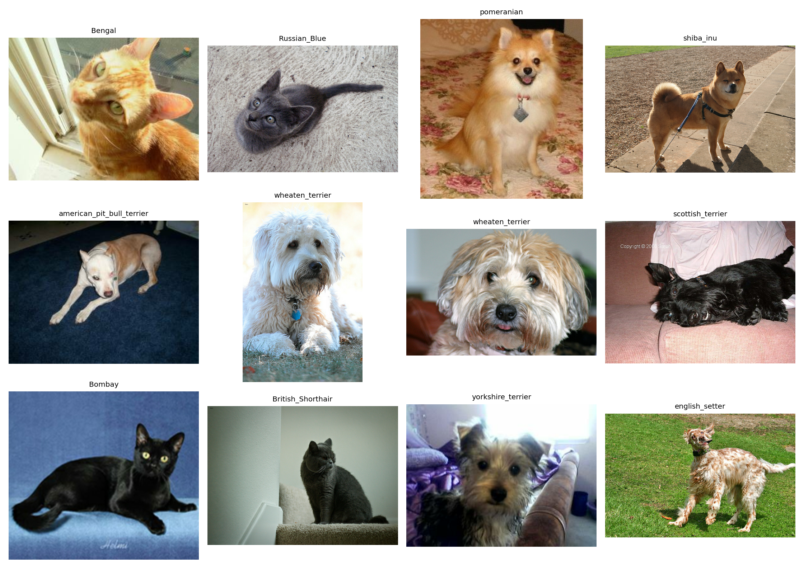
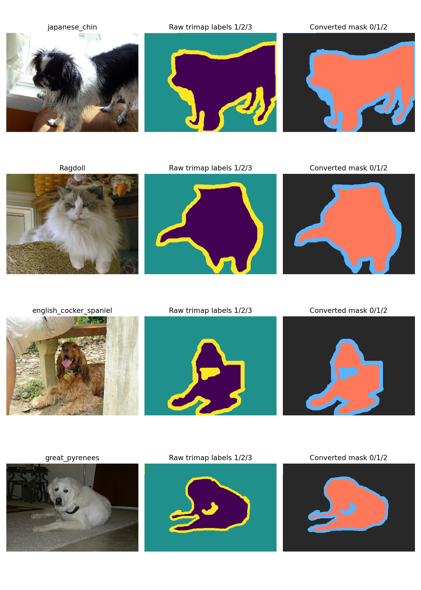
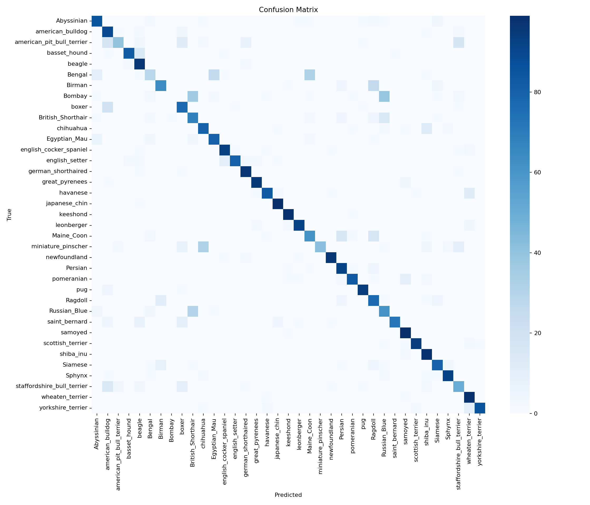
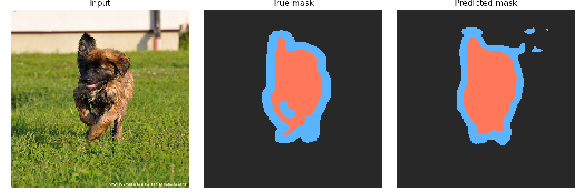
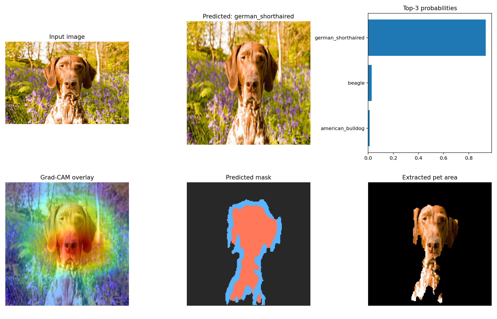

# PetVision: Pet Breed Classification, Segmentation, and Explainability

PetVision is a Computer Vision / Deep Learning final project using the Oxford-IIIT Pet Dataset. The project classifies 37 cat and dog breeds, segments pets from image backgrounds, and provides explainability with Grad-CAM.


## Dataset

The project uses Oxford-IIIT Pet through TensorFlow Datasets:

```python
tfds.load("oxford_iiit_pet:4.*.*", with_info=True, as_supervised=False)
```

Dataset summary:

- 37 pet breed classes
- 3,680 official training images
- 3,669 official test images
- Breed labels, species labels, and pixel-level trimap segmentation masks
- Trimap masks are converted from labels `1,2,3` to `0,1,2`

## Main Features

- Baseline CNN classifier trained from scratch
- MobileNetV2 transfer learning classifier with ImageNet weights
- U-Net-style pet segmentation model
- Top-1 and Top-3 classification evaluation
- Precision, recall, F1-score, and confusion matrix
- Pixel accuracy, mean IoU, and Dice coefficient for segmentation
- Grad-CAM explainability utilities and demo inference notebook
- Streamlit demo app in `demo/app.py`

## Repository Structure

```text
PetVision-DeepLearning/
|-- README.md
|-- requirements.txt
|-- report/
|-- notebooks/
|-- src/
|-- models/
|-- results/
`-- demo/
```

## Local Installation

```bash
pip install -r requirements.txt
```

## Running on Google Colab with Git

Recommended workflow:

1. Push changes from your PC to GitHub.
2. Pull the newest changes inside Colab.
3. Run notebooks in Colab with GPU enabled.
4. Commit/push result files only when needed.

In Colab, use the **Google Colab Git Setup** cell at the top of each notebook. Replace the placeholder:

```python
REPO_URL = "https://github.com/YOUR_USERNAME/..."
```

with your real GitHub repository URL.

Enable GPU before training:

```text
Runtime -> Change runtime type -> Hardware accelerator -> GPU -> Save
```

Useful Colab Git commands:

```bash
git pull
git status
git add notebooks results report README.md
git commit -m "Update training results"
git push
```

## How to Run

Run notebooks in order:

1. `notebooks/01_data_exploration.ipynb`
2. `notebooks/02_baseline_cnn_classification.ipynb`
3. `notebooks/03_transfer_learning_classification.ipynb`
4. `notebooks/04_unet_segmentation.ipynb`
5. `notebooks/05_gradcam_interpretability.ipynb`
6. `notebooks/06_demo_inference.ipynb`

Notebook 03 saves `models/best_classifier.keras`. Notebook 04 saves `models/best_segmenter.keras`. Notebooks 05 and 06 require those saved models.

## Final Results

Classification results on the official test split:

| Model | Input Size | Test Accuracy | Top-3 Accuracy | Macro F1 | Model Size |
|---|---:|---:|---:|---:|---:|
| Baseline CNN | 128x128 | 3.62% | 8.99% | 0.56% | 3.88 MB |
| MobileNetV2 transfer | 224x224 | 79.07% | 94.06% | 77.51% | 22.43 MB |

Segmentation results:

| Model | Input Size | Pixel Accuracy | Mean IoU | Dice | Model Size |
|---|---:|---:|---:|---:|---:|
| U-Net | 160x160 | 83.97% | 63.59% | 76.10% | 90.13 MB |

The baseline CNN was trained for a short 3-epoch run and performs poorly, which is useful as a clear baseline. MobileNetV2 transfer learning is much stronger and reaches high Top-3 accuracy, showing that most remaining mistakes are among visually similar breeds.

## Saved Artifacts

Models:

- `models/baseline_classifier.keras`
- `models/best_classifier.keras`
- `models/best_segmenter.keras`

Classification outputs:

- `results/classification/baseline_training_curves.png`
- `results/classification/baseline_confusion_matrix.png`
- `results/classification/baseline_wrong_predictions.png`
- `results/classification/transfer_training_curves.png`
- `results/classification/transfer_confusion_matrix.png`
- `results/classification/model_comparison_table.csv`

Segmentation outputs:

- `results/segmentation/segmentation_training_curves.png`
- `results/segmentation/segmentation_metrics.csv`
- `results/segmentation/mask_examples.png`

General figures:

- `results/figures/sample_images.png`
- `results/figures/sample_masks.png`
- `results/figures/class_distribution.png`
- `results/figures/image_size_distribution.png`
- `results/figures/demo_inference.png`

## Example Outputs

Sample images:



Sample segmentation masks:



Transfer learning confusion matrix:



Segmentation examples:



Demo inference:



## Demo

Notebook demo:

```text
notebooks/06_demo_inference.ipynb
```

Streamlit demo after training:

```bash
streamlit run demo/app.py
```

The demo loads the classifier and segmenter, predicts the breed, displays Top-3 probabilities, creates a Grad-CAM overlay, predicts the segmentation mask, and extracts the pet area.

## Notes

- MobileNetV2 is the final classification model.
- U-Net is the final segmentation model.
- Grad-CAM support is implemented in `src/gradcam.py` and used by the demo notebook/app.
- Dedicated Grad-CAM figure files can be generated by rerunning notebook 05.

## Credits and References

- Christian Mata, PhD: Computer Vision, EMSSE
- Oxford-IIIT Pet Dataset
- TensorFlow Datasets
- Keras Applications
- Grad-CAM: Selvaraju et al., "Grad-CAM: Visual Explanations from Deep Networks via Gradient-based Localization"
